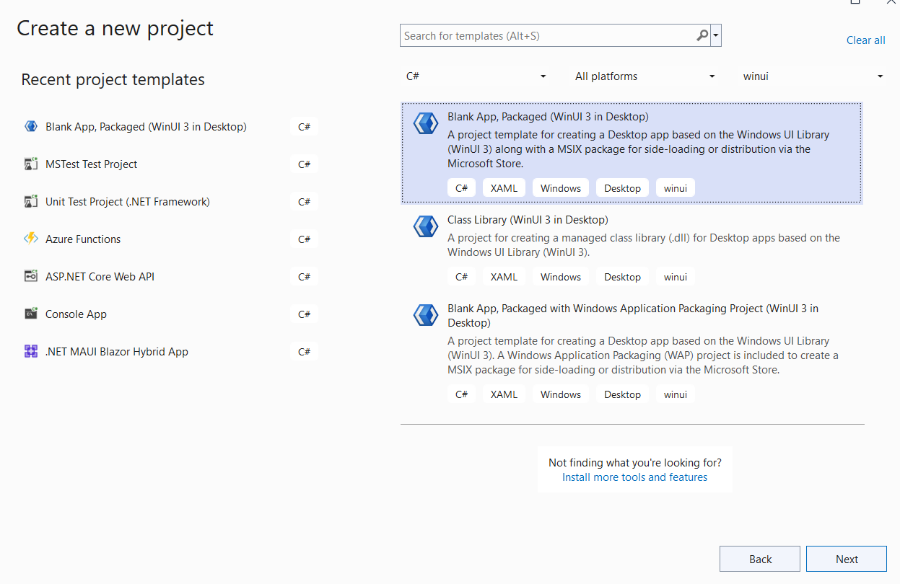
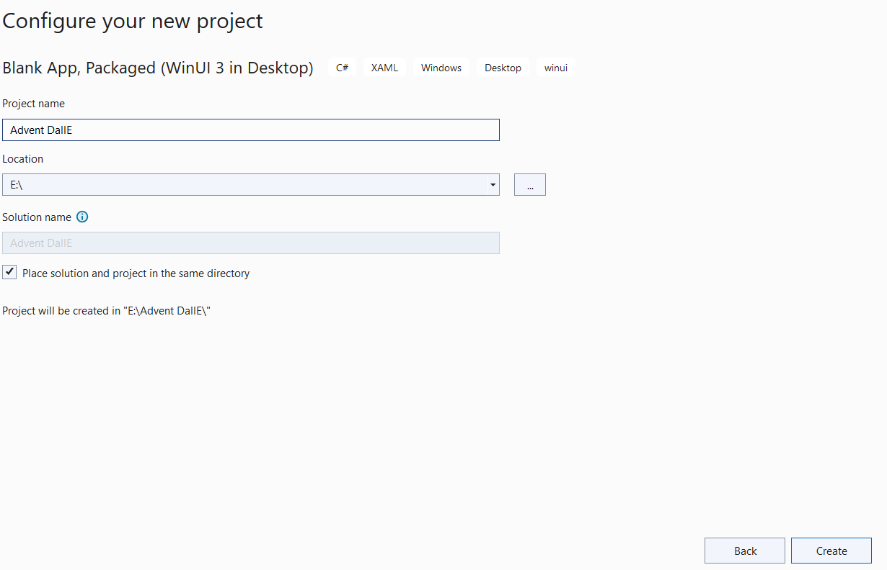
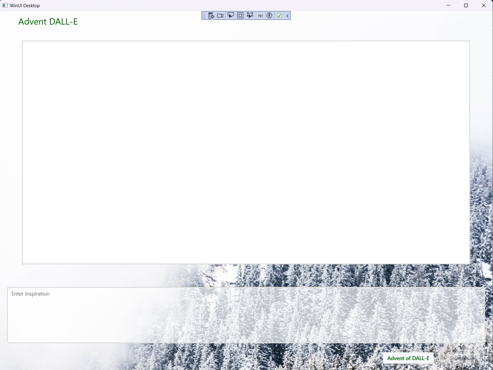
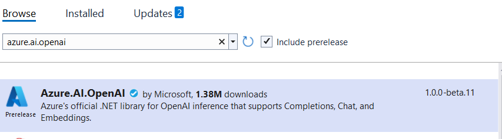

# Advent DALL-E (C# Advent 2023 Day 17)

>  *This article is part of C# Advent 2023. For more articles in the series by other authors, visit [csadvent.christmas](https://www.csadvent.christmas/).*

NOTE: This repo contains the completed project, I recommend that you **do not** clone the repo unless you want to skip to the end!

  ---


### Santa needs a little help!
Merry Christmas! Santa has been busy this year and needed a little help generating images for his Christmas cards. He realized that DALL-3 would be perfect, but he doesn't have time to learn how to write effective prompts for DALL-E. 

Santa Thought: ***What if I had an AI create the image prompts for me?***

Santa called in Cradle, his Chief ML Engineer Elf, and asked if it was possible.  Cradle replied its not only possible but I'll have it ready for you in under an hour!

### Creating the Win UI3 Project

To get started lets open up Visual Studio and create a new Win UI 3 Project.





Click Create.

### Creating the UI

We are going to create a UI that looks like this:  



Since the focus of this tutorial is using Open AI models in C# we are going to skip over the details of how the XAML works but if you are familiar with any other XAML UI development this should feel familiar and comfortable.

1. Find the MainWindow.XAML file.  You will find a section that goes from `<StackPanel>` to `</StackPanel>`.  Remove this and replace it with the following code:

```
    <Grid>
        <Grid.RowDefinitions>
            <RowDefinition Height="1*" />
            <RowDefinition Height="9*" />
            <RowDefinition Height="3*" />
            <RowDefinition Height="1*" />
        </Grid.RowDefinitions>
        <Image Grid.Row="0" Grid.RowSpan="4" Source="Assets/background.jpg" Stretch="UniformToFill"></Image>
        <TextBlock Grid.Row="0" FontFamily="Segoe UI" FontSize="24" Margin="50,10,0,5" Foreground="DarkGreen">Advent DALL-E</TextBlock>

        <Border Grid.Row="1" BorderThickness="2" BorderBrush="Gainsboro" Background="#FFFFFFFF" Margin="60,10">
            <Image x:Name="GeneratedImage" Stretch="Uniform"></Image>
        </Border>
        <ProgressRing x:Name="ProgressIndicator" Grid.Row="1" IsActive="False" Background="LightGray" Width="100" Height="100" />
        <TextBlock x:Name="GeneratedPrompt" Visibility="Collapsed" Grid.Row="1" FontFamily="Segoe UI" FontSize="18" Foreground="Black" HorizontalAlignment="Center" VerticalAlignment="Bottom" TextWrapping="Wrap" Width="auto" Height="auto" Margin="80,50">Prompt goes here</TextBlock>

        <TextBox x:Name="HumanPrompt" Grid.Row="2" PlaceholderText="Enter Inspiration" AutomationProperties.Name="multi-line TextBox" BorderBrush="Gainsboro" BorderThickness="2" Margin="20,50,20,5" Width="auto" Height="auto" AcceptsReturn="True" IsSpellCheckEnabled="True"></TextBox>
        
        <StackPanel Grid.Row="3" Orientation="Horizontal" HorizontalAlignment="Right" Margin="30,0" Spacing="30">
            <Button x:Name="Generate" Click="GenerateImage_Click" Background="GhostWhite" Foreground="DarkGreen" FontWeight="SemiBold">Advent of DALL-E</Button>
            <Button x:Name="Save" Click="Save_Click" Background="GhostWhite" Foreground="DarkGreen" FontWeight="SemiBold" IsEnabled="False">Save Image</Button>
        </StackPanel>

        <TeachingTip x:Name="SaveNotification"
	        Title="Image Saved"
	        Subtitle=""
	        PreferredPlacement="Auto"
	        PlacementMargin="20"
	        IsLightDismissEnabled="True"
	        CloseButtonContent="Got it!">
        </TeachingTip>
    </Grid>
```

2. Now open MainWindow.xaml.cs, remove the myButton_Click method and replace it with:

```
        private async void Save_Click(object sender, RoutedEventArgs e)
        {
        }

        private async void GenerateImage_Click(object sender, RoutedEventArgs e)
        {
        }

        private void ShowPrompt(string prompt)
        {
            GeneratedPrompt.Text = prompt;
            GeneratedPrompt.Visibility = Visibility.Visible;
        }

        private void HidePrompt()
        {
            GeneratedPrompt.Visibility = Visibility.Collapsed;
        }

        private void WorkingState()
        {
            Save.IsEnabled = false;
            Generate.IsEnabled = false;
            ProgressIndicator.IsActive = true;
        }

        private void FinishedState()
        {
            ProgressIndicator.IsActive = false;
            Generate.IsEnabled = true;
        }

        private const string SAVE_FOLDER = "Advent DALLE";

        private static async Task<string> GetPicturesFolder()
        {
            var myPictures = await StorageLibrary.GetLibraryAsync(KnownLibraryId.Pictures);
            Directory.CreateDirectory(Path.Combine(myPictures.SaveFolder.Path, SAVE_FOLDER));
            return myPictures.SaveFolder.Path;
        }
```

3. Finally download the background image from here:

[https://github.com/CameronVetter/Dalle3-CSharp-Advent-Day-17/blob/main/Assets/background.jpg](https://raw.github.com/CameronVetter/Dalle3-CSharp-Advent-Day-17/main/Assets/background.jpg)

4. Place a copy of this file in the Assets folder of your project.
5. Run the project, you should now have a complete UI that looks like the above image, but does nothing.

### Finding your Open AI API Key

You will need the API key of your personal Open AI account to continue.  

1. Go to the [Open AI developer Portal](https://platform.openai.com/)
2. Either Login or Sign Up for a new account.
3. Click the API Keys menu item on the left.
4. Click Create new secret key
5. Give it any name such as "adventcsharp"
6. Click Create secret key
7. Add your key to MainWindow.xaml.cs to the top of your MainWindow class as a constant like this:

```
    private const string OPENAI_KEY = "<api key here>";
```

### Have GPT-4 Create a prompt

Instead of carefully creating a prompt to generate an image we will have GPT-4 do it for us.  

1. Add the nuget package *Azure.AI.OpenAI* to your project.  You must check "Include prerelease" to find this package. This works package works for both Open AI and Azure Open AI.  I recommend Azure Open AI for enterprise and commerical projects, and either one for personal or fun projects.



2. Create a new method called Generate Prompt:

```
       private static async Task<string> GeneratePrompt(string userPrompt)
       {

       }
```
3. Inside this method add the following line to instantiate a new openai client:

```
            OpenAIClient client = new(OPENAI_KEY);
```
4.  Use the client to generate a completion.  Add the following code:


```
           var responseCompletion = await client.GetChatCompletionsAsync(
               new ChatCompletionsOptions()
               {
                   ChoiceCount = 1,
                   Temperature = 1,
                   MaxTokens = 256,                    
                   DeploymentName = "gpt-4",
                   Messages = {
                       new ChatRequestSystemMessage("Create a prompt for Dall-e that will generate a beautiful Christmas scene using the following text for inspiration:"),
                       new ChatRequestUserMessage(userPrompt),
                   },
               });
```

This makes a requiest using client to get a chat completion asyncronously.  We want it to generate only 1 completion.  We want it to be very creative so we give it a temperature of 1.0.  We also want it to be fairly verbose and descriptive so we set MaxTokens to 256.  Finally, We specify that we want gpt-4.  

In the messages we create a prompt, feel free to experiment with this prompt later but start with this prompt which will get great results.  Notice that we place the prompt into a System Message, and what the user enters for inspiration is the UserMessage.


5. Finally return the result of the completion.  The final method should look like this:
```
       private static async Task<string> GeneratePrompt(string userPrompt)
       {
           OpenAIClient client = new(OPENAI_KEY);

           var responseCompletion = await client.GetChatCompletionsAsync(
               new ChatCompletionsOptions()
               {
                   ChoiceCount = 1,
                   Temperature = 1,
                   MaxTokens = 256,                    
                   DeploymentName = "gpt-4",
                   Messages = {
                       new ChatRequestSystemMessage("Create a prompt for Dall-e that will generate a beautiful Christmas scene using the following text for inspiration:"),
                       new ChatRequestUserMessage(userPrompt),
                   },
               });

           return responseCompletion.Value.Choices[0].Message.Content;
       }
```

6. Let's connect up the generate button, change GenerateImage_Click to the following:

```
        private string _currentPrompt;

        private async void GenerateImage_Click(object sender, RoutedEventArgs e)
        {
            GeneratedImage.Source = null;
            WorkingState();

            _currentPrompt = await GeneratePrompt(HumanPrompt.Text);

            ShowPrompt(_currentPrompt);

            FinishedState();
        }
```

7. Run the solution.  Try entering some inspiration for your Christmas image and click generate.
8. Notice that if you click generate again you get a totally different prompt, this is because of the high temperature.

### Generating the Picture with DALL-E 3

Now that we have really good prompts for image generation being created, lets use them to generate the image!

1. Create a new method called Generate Image:

```
       private async Task<BitmapImage> GenerateImage(String prompt)
       {

       }
```
2. Add the following line to instantiate a new client:

```
            OpenAIClient client = new(OPENAI_KEY);
```
1. Use the client to generate an image.  Add the following code:


```
            var responseImages = await client.GetImageGenerationsAsync(
                new ImageGenerationOptions()
                {
                    ImageCount = 1,
                    Prompt = prompt,
                    Size = ImageSize.Size1792x1024,
                    DeploymentName = "dall-e-3"
                });
```
This tells the client that we want it to generate an image asyncronously.  We want it to generate only 1 image.  We want it to be very high resolution so we specify the largest size allowed. We specify that we want dall-e-3.  Finally we pass it the prompt, this is the prompt generated by GPT-4! Yes that's right, an AI is using an AI model!

4. Finally return the result of the generation.  The final method should look like this:
```
        private Uri _currentImage;

        private async Task<BitmapImage> GenerateImage(String prompt)
        {
            OpenAIClient client = new(OPENAI_KEY);

            var responseImages = await client.GetImageGenerationsAsync(
                new ImageGenerationOptions()
                {
                    ImageCount = 1,
                    Prompt = prompt,
                    Size = ImageSize.Size1792x1024,
                    DeploymentName = "dall-e-3"
                });

            _currentImage = responseImages.Value.Data[0].Url;
            return new BitmapImage(_currentImage);
        }
```

5. Let's modify the code for the generate button, here is the complete new function:

```
        private async void GenerateImage_Click(object sender, RoutedEventArgs e)
        {
            GeneratedImage.Source = null;
            WorkingState();

            _currentPrompt = await GeneratePrompt(HumanPrompt.Text);

            ShowPrompt(_currentPrompt);
            var image = await GenerateImage(_currentPrompt);
            HidePrompt();

            GeneratedImage.Source = image;

            FinishedState();
            Save.IsEnabled = true;
        }
```

7. Run the solution.  Try entering some inspiration for your Christmas image and click generate.
8. Notice how first we generate the prompt and then use that prompt to generate an image!

### Saving the Picture

We need one more thing for Santa's solution to be complete, we need the ability to save the images!

1. Replace the Save_Click method with the following:

```       
        private async void Save_Click(object sender, RoutedEventArgs e)
        {
            WorkingState();
            var folder = await GetPicturesFolder();
            var destination = Path.Combine(folder, SAVE_FOLDER, $"{HumanPrompt.Text}.png");
            var destination2 = Path.Combine(folder, SAVE_FOLDER, $"{HumanPrompt.Text}.txt");

            using (var client = new WebClient())
            {
                client.DownloadFile(_currentImage, destination);
            }

            using (StreamWriter outputFile = new StreamWriter(destination2, false))
            {
                outputFile.WriteLine(_currentPrompt);
            }

            SaveNotification.Subtitle = destination;
            SaveNotification.IsOpen = true;
            FinishedState();
        }
```

2. Run the solution.  Try different prompts and save your favorites!

---

## Santa Returns


An hour later Santa returns.  Cradle, the elf, is just finshing a frantic coding session.  Cradle looks up and smiles! 

**Merry Christmas**